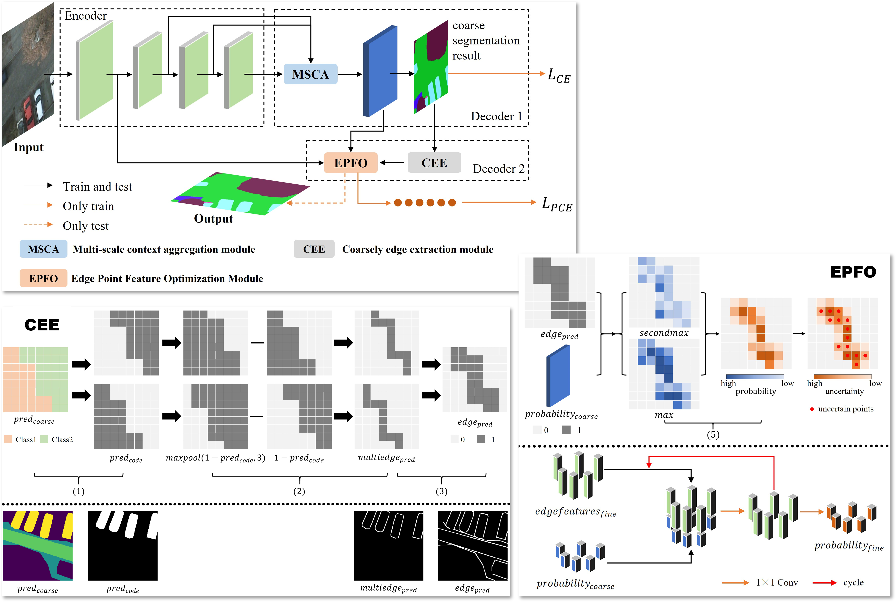
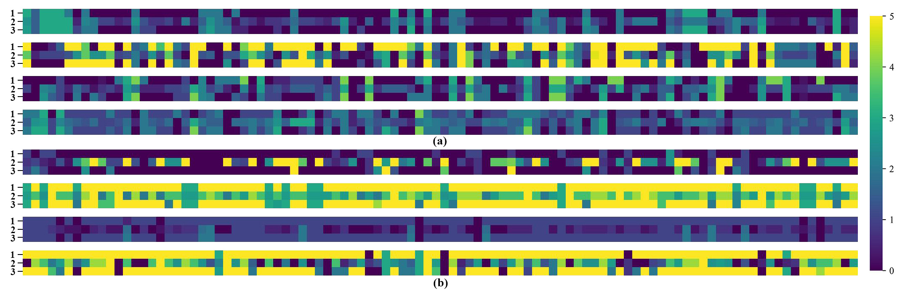

<div align="center">

<h1>Multiscale Semantic Segmentation of Remote Sensing Images Based on Edge Optimization</h1>

<div>
    <h3><strong>MSEONet</strong></h3>
</div>

<div>
    <strong>Wubiao Huang</strong>, Fei Deng*, Haibing Liu, Mingtao Ding, Qi Yao
</div>

<div>
    <h4 align="center">
        This repository is an official implementation of  <a href="https://doi.org/10.1109/TGRS.2025.3553524" target='_blank'>[Paper]</a> <a href="https://github.com/HuangWBill/MSEONet/blob/master/paper.pdf" target='_blank'>[PDF]</a>
    </h4>
</div>

</div>


___________

## Table of Contents
* [News](#News)
* [Abstract](#Abstract)
* [Dependencies and installation](#Dependencies_and_installation)
* [Dataset](#Dataset)
* [Usage](#Usage)
* [Models and results](#Models_and_results)
* [Citation](#Citation)
* [Acknowledgement](#Acknowledgement)
* [Contact](#Contact)

___________

## News
- [2024-4-10] The **models** have been released.
- [2025-4-01] The **codes** have been released.
- [2025-3-19] The **paper** has been accepted by ***IEEE Transactions on Geoscience and Remote Sensing (TGRS)***.

## Abstract
> *Semantic segmentation of remote sensing images is crucial for disaster monitoring, urban planning, and land use. Due to scene complexity and multi-scale features of targets, semantic segmentation of remote sensing images has become a challenging task. Deep convolutional neural networks capture remote contextual dependencies is limited. Meanwhile, restoring the image size quickly leads to under-sampling at object edges, resulting in poor boundary prediction. Therefore, this paper proposes a multi-scale semantic segmentation network of remote sensing images based on edge optimization, namely MSEONet. The decoder of the network consists of a multi-scale context aggregation (MSCA) module, a coarse edge extraction (CEE) module, and an edge point feature optimization (EPFO) module. The MSCA module is used to capture multi-scale contextual information and global dependencies between pixels. The CEE module is used for boundary extraction of multi-class coarse segmentation results. The EPFO module is used to optimize edge point features during the up-sampling process. We conducted extensive experiments on the International Society for Photogrammetry and Remote Sensing (ISPRS) Potsdam 2D dataset, the ISPRS Vaihingen 2D dataset and FLAIR #1 dataset. The results show the effectiveness and superiority of our proposed MSEONet model compared to most of the state-of-the-art models. The CEE and EPFO modules can enhance the edge segmentation effect without increasing the computational and parametric quantities too much. The code is publicly available at https://github.com/HuangWBill/MSEONet.*

## Dependencies_and_installation

```bash
# 0. Basic environmental 
anaconda, cuda==11.1

# 1. create new anaconda env
conda create -n MSEONet python=3.8
conda activate MSEONet

# 2. git clone this repository
git clone https://github.com/HuangWBill/MSEONet.git
cd MSEONet

# 3. install torch and dependencies
pip install -r requirements.txt

# The mmcv, mmengine, mmsegmentation, torch, torchaudio and torchvision versions are strict.
```

## Dataset
<table>
<tr>
<th>Dataset</th><th>Class</th><th>Link</th><th>Storage path</th>
</tr>
<tr>
<td>Potsdam</td><td rowspan=2>impervious surfaces, building, low vegetation,tree, car, background</td><td rowspan=2> <a href="http://www2.isprs.org/commissions/comm3/wg4/semantic-label-ing.html" target='_blank'>[ISPRS]</a></td><td>data\Potsdam_RGB_512</td>
</tr>
<tr>
<td>Vaihingen</td><td>data\Vaihingen_RGB_512</td>
</tr>
<tr>
<td>FLAIR #1</td><td>building, pervious surface, impervious surface, bare soil, water, coniferous, deciduous, brushwood, vineyard, herbaceous vegetation, agricultural land, plowed land</td><td> <a href="https://ignf.github.io/FLAIR/#FLAIR1" target='_blank'>[FLAIR #1]</a></td><td>data\FLAIR1_512</td>
</tr>
</table>

- The datasets used in the paper are all **publicly available** and can be downloaded and preprocessed according to the description in the paper.
- **Strictly** organize data according to the example data.


## Usage
```shell
# train MSEONet in Potsdam
python tools/train.py --config configs/MSEONet_r101-d8_4xb4-80k_Potsdam-512x512.py --work-dir result/MSEONet_Potsdam

# train MSEONet in Vaihingen
python tools/train.py --config configs/MSEONet_r101-d8_4xb4-80k_Vaihingen-512x512.py --work-dir result/MSEONet_Vaihingen

# train MSEONet in FLAIR #1
python tools/train.py --config configs/MSEONet_r101-d8_4xb4-80k_FLAIR1-512x512.py --work-dir result/MSEONet_FLAIR1

# test MSEONet in Potsdam
python tools/test.py --config configs/MSEONet_r101-d8_4xb4-80k_Potsdam-512x512.py --checkpoint result/MSEONet_Potsdam/iter_80000_Potsdam.pth --work-dir result/MSEONet_Potsdam/result --out result/MSEONet_Potsdam/result/dataset_pre

# test MSEONet in Vaihingen
python tools/test.py --config configs/MSEONet_r101-d8_4xb4-80k_Vaihingen-512x512.py --checkpoint result/MSEONet_Vaihingen/iter_80000_Vaihingen.pth --work-dir result/MSEONet_Vaihingen/result --out result/MSEONet_Vaihingen/result/dataset_pre

# test MSEONet in FLAIR #1
python tools/test.py --config configs/MSEONet_r101-d8_4xb4-80k_FLAIR1-512x512.py --checkpoint result/MSEONet_FLAIR1/iter_80000_FLAIR1.pth --work-dir result/MSEONet_FLAIR1/result --out result/MSEONet_FLAIR1/result/dataset_pre
```

## Models_and_results
- **train log and model download**
 
| Model      | Dataset            | Device  | Iterations | mIoU  | Log                                                 | checkpoint                                                                               |
| :--------: | :----------------: | :-----: | :--------: | :---: | :-------------------------------------------------: | :--------------------------------------------------------------------------------------: |
| MSEONet    | Potsdam_RGB_512    | RTX4090 | 80000      | 74.51 | [log](./log/MSEONet_Potsdam/20240123_081227.log)    | [download](https://zenodo.org/records/15068018/files/iter_80000_Potsdam.pth?download=1)  |
| MSEONet    | Vaihingen_IRRG_512 | RTX4090 | 80000      | 70.08 | [log](./log/MSEONet_Vaihingen/20240120_001751.log)  | [download](https://zenodo.org/records/15068018/files/iter_80000_Vaihingen.pth?download=1)|
| MSEONet    | FLAIR1_512         | RTX4090 | 80000      | 58.72 | [log](./log/MSEONet_FLAIR1/20240911_210131.zip)     | [download](https://zenodo.org/records/15068018/files/iter_80000_FLAIR1.pth?download=1)   |


- **Results**
> Table 1. Quantitative comparison results with State-of-the-art network.
<table>
<tr>
<th rowspan=2>Method</th><th colspan=3>Potsdam</th><th colspan=3>Vaihingen</th><th colspan=3>FLAIR #1</th>
</tr>
<tr>
<td align="center">OA (%)</td><td align="center">mF1 (%)</td><td align="center">mIoU (%)</td><td align="center">OA (%)</td><td align="center">mF1 (%)</td><td align="center">mIoU (%)</td><td align="center">OA (%)</td><td align="center">mF1 (%)</td><td align="center">mIoU (%)</td>
</tr>
<tr>
<td align="center">DANet</td><td align="center">88.54</td><td align="center">83.40</td><td align="center">73.77</td><td align="center">87.68</td><td align="center">80.31</td><td align="center">69.11</td><td align="center">72.74</td><td align="center">69.38</td><td align="center">55.09</td>
</tr>
<tr>
<td align="center">CCNet</td><td align="center">88.57</td><td align="center">83.48</td><td align="center">73.87</td><td align="center">87.56</td><td align="center">80.04</td><td align="center">68.83</td><td align="center">73.75</td><td align="center">70.84</td><td align="center">56.96</td>
</tr>
<tr>
<td align="center">ACFNet</td><td align="center">88.38</td><td align="center">83.66</td><td align="center">73.89</td><td align="center">87.56</td><td align="center">80.06</td><td align="center">68.80</td><td align="center">69.21</td><td align="center">67.50</td><td align="center">52.53</td>
</tr>
<tr>
<td align="center">GCNet</td><td align="center">88.67</td><td align="center">83.88</td><td align="center">74.28</td><td align="center">87.68</td><td align="center">80.46</td><td align="center">69.23</td><td align="center">74.16</td><td align="center">71.82</td><td align="center">57.87</td>
</tr>
<tr>
<td align="center">DNLNet</td><td align="center">88.70</td><td align="center">83.78</td><td align="center">74.18</td><td align="center">87.72</td><td align="center">80.46</td><td align="center">69.27</td><td align="center">73.18</td><td align="center">69.83</td><td align="center">55.70</td>
</tr>
<tr>
<td align="center">LANet</td><td align="center">88.37</td><td align="center">82.97</td><td align="center">73.28</td><td align="center">87.58</td><td align="center">79.88</td><td align="center">68.59</td><td align="center">71.30</td><td align="center">66.36</td><td align="center">52.01</td>
</tr>
<tr>
<td align="center">A2FPN</td><td align="center">88.55</td><td align="center">83.92</td><td align="center">74.24</td><td align="center">87.47</td><td align="center">80.04</td><td align="center">68.73</td><td align="center">72.05</td><td align="center">70.41</td><td align="center">55.75</td>
</tr>
<tr>
<td align="center">CGRSeg</td><td align="center">88.41</td><td align="center">83.57</td><td align="center">73.80</td><td align="center">87.67</td><td align="center">80.32</td><td align="center">69.02</td><td align="center">72.48</td><td align="center">70.26</td><td align="center">55.63</td>
</tr>
<tr>
<td align="center">MSEONet (ours)</td><td align="center">88.68</td><td align="center">84.17</td><td align="center">74.51</td><td align="center">87.61</td><td align="center">81.38</td><td align="center">70.08</td><td align="center">74.06</td><td align="center">72.69</td><td align="center">58.72</td>
</tr>
</table>

> Potsdam


> Vaihingen


> FLAIR #1


> Visualization of the effect of the EPFO module on some edge points on different datasets. (a) The Vaihingen dataset, (b) the Potsdam dataset, 1-true labels, 2-coarse results before EPFO, 3-fine results after EPFO, color bar - object classes.


## Citation
Please kindly cite the papers if this code is useful and helpful for your research: 
```
@article{huang2025mseonet,
  title = {Multi-Scale Semantic Segmentation of Remote Sensing Images Based on Edge Optimization},
  author = {Huang, Wubiao and Deng, Fei and Liu, Haibing and Ding, Mingtao and Yao, Qi},
  journal = {IEEE Transactions on Geoscience and Remote Sensing},
  volume = {},
  number = {},
  pages = {1-13},
  year = {2025},
  DOI = {10.1109/TGRS.2025.3553524}
}
```

## Acknowledgement
This implementation is based on [MMSegmentation](https://github.com/open-mmlab/mmsegmentation). Thanks for the awesome work.

## Contact
If you have any questions or suggestions, feel free to contact [Wubiao Huang](huangwubiao@whu.edu.cn).

